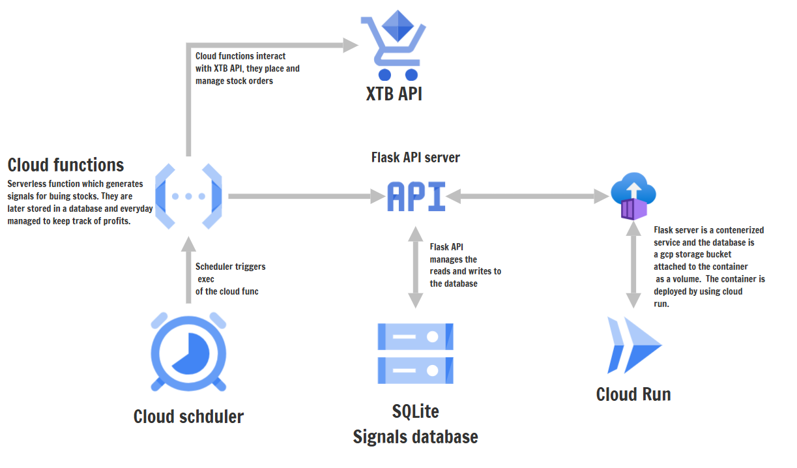

# Implementation of Turtle Trading Strategy   
An automated implementation of trading strategy deployed   
on google cloud platform. The signals to buy stocks are  
generated by the python script, saved to a database and  
orders are placed on the xStation platform. The database  
is a SQLlite instance, deployed as a volume to a Docker  
container. The docker container run a flask server, which   
manages the reads and writes from the database. The container    
is deployed with the google run service. Even though the  
service itseff is state-less, the data is persisted. The  
SQLlite database is stored in a google storage bucker and  
attached to the container as a volume. The architecture is  
presented below. 

